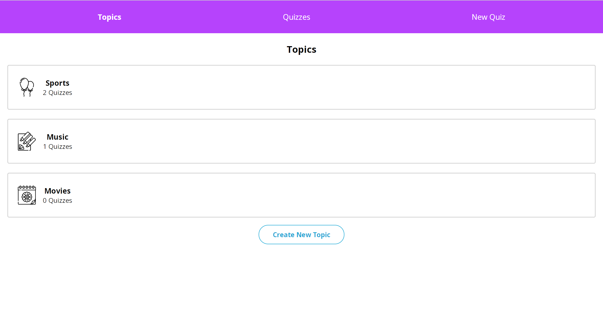

# Flashcards

### Overview
Flashcard-style quiz app completed as part of the Codeacademy Full-Stack Engineer pathway. Users will be able to create their own topics, quizzes for those topics, and flashcards for those quizzes. Users will also be able to interact with their quizzes by flipping flashcards over.

To start:
- Under the 'topic' heading, create a topic with associated topic icon.
- Navigate to 'create quiz' and add cards to form a quiz and assign this quiz a topic.
- View quizzes in the 'quiz' section.

### Learning Objectives
Practice using Redux and Redux Toolkit to manage the complex state of a flashcard-style quiz app.

